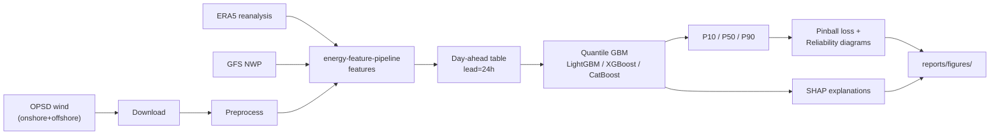

# wind-quantile-forecast

Day-ahead probabilistic wind power forecast producing **P10 / P50 / P90** quantiles, evaluated with pinball loss and reliability diagrams.

## Why it matters

Most utility production forecasting still runs on quantile gradient boosting models, not deep learning. This project covers the full production stack: LightGBM, XGBoost, CatBoost, pinball loss, SHAP interpretability, and target encoding for high-cardinality features.

## Problem

Given historical wind generation and weather features, predict the next-day hourly wind power distribution as three quantiles:

| Quantile | Label | Meaning |
|----------|-------|---------|
| 0.10 | P10 | 10 % chance actual generation falls below this value |
| 0.50 | P50 | Median (point) forecast |
| 0.90 | P90 | 90 % chance actual generation falls below this value |

## Data source

**Target:** German hourly wind power (OPSD onshore + offshore actual generation).

**Features:** Reuses the [energy-feature-pipeline](https://github.com/mehmetertac/energy-feature-pipeline) ERA5 reanalysis + GFS NWP stack (calendar, wind physics, hub-height extrapolation).

| Layer | Source | Role |
|-------|--------|------|
| Generation | [OPSD](https://open-power-system-data.org/) time series | `wind_mw` target |
| Reanalysis | Copernicus ERA5 (CDS) | Hindcast weather + physics features |
| NWP | GFS via Herbie | Day-ahead forecast covariates at 24 h lead |

Install the sibling feature pipeline, then pull the dataset:

```powershell
pip install -r requirements-dev.txt
pip install -r requirements-weather.txt   # editable install of ../energy-feature-pipeline
pip install -e .

# OPSD wind + ERA5/NWP features → data/processed/day_ahead_wind.parquet
pull-wind-data --start 2019-06-01 --end 2019-06-15

# Download missing ERA5 months from Copernicus (needs ~/.cdsapirc)
pull-wind-data --download-era5
```

The sibling project's cached OPSD parquet is used automatically when present at
`../energy-feature-pipeline/energy-feature-pipeline/data/raw/`.

## Tech stack

- **Models:** LightGBM, XGBoost, CatBoost (quantile regression via pinball loss)
- **Interpretability:** SHAP
- **Encoding:** Target encoding for high-cardinality categorical features
- **Evaluation:** Pinball loss, coverage metrics, reliability (calibration) diagrams

## Repository layout

```
wind-quantile-forecast/
├── src/wind_quantile_forecast/
│   ├── config.py              # paths, quantiles, seeds
│   ├── data/                  # OPSD download + preprocessing
│   ├── features/              # calendar, lags, target encoding
│   ├── models/                # pinball loss + QuantileGBM wrapper
│   ├── evaluation/            # metrics, reliability, plots
│   ├── interpret/             # SHAP explanations
│   └── cli.py                 # pipeline entry point
├── tests/
│   ├── unit/                  # unit tests (pinball loss, etc.)
│   └── integration/           # end-to-end pipeline tests
├── data/{raw,processed}/      # data directories (contents gitignored)
├── reports/figures/           # calibration plots + SHAP output
├── notebooks/                 # exploratory analysis
├── scripts/                   # pre-commit helpers
├── AGENTS.md                  # contributor / agent governance rules
└── requirements.txt
```

## Pipeline



## Setup

```powershell
# Clone and enter the repo
git clone https://github.com/mehmetertac/wind-quantile-forecast-.git
cd wind-quantile-forecast-

# Create virtual environment
py -m venv .venv
.venv\Scripts\Activate.ps1

# Install dependencies
pip install -r requirements-dev.txt
pip install -e .

# Install pre-commit hooks (runs tests + file-size check before commit)
pre-commit install
```

## Usage

```powershell
# Run rolling-origin CV → results/metrics.csv (default: LightGBM)
py scripts/run_cv.py -v

# XGBoost or CatBoost (multi-quantile by default)
py scripts/run_cv.py --backend xgboost -v
py scripts/run_cv.py --backend catboost -v

# CatBoost native categoricals on hour_season (vs target encoding)
py scripts/run_cv.py --backend catboost --cat-encoding native -v

# Compare all backends → results/backend_comparison.csv
py scripts/run_comparison.py -v

# Run the full pipeline (not yet implemented)
wind-forecast --country DE --backend lightgbm

# Run tests
pytest

# Run linting
ruff check src tests
```

## Backend comparison

Rolling-origin CV with fold-wise target encoding on ``hour_season`` (hour × season, 96 levels).
CatBoost is also evaluated with native categorical handling (no pre-encoding).

| backend | encoding | pinball_q10 | pinball_q50 | pinball_q90 | pi_coverage | mae | rmse | mape | train_time_sec | n_folds |
| --- | --- | --- | --- | --- | --- | --- | --- | --- | --- | --- |
| lightgbm | target | 646.7119 | 1610.0332 | 1523.4169 | 0.5782 | 3220.0664 | 4175.6221 | 43.6787 | 2.2207 | 5 |
| xgboost | target | 973.1068 | 2093.4129 | 1416.5845 | 0.4691 | 4186.8257 | 5291.5195 | 62.5415 | 1.8348 | 5 |
| catboost | target | 992.5531 | 1570.2403 | 1428.1022 | 0.3992 | 3140.4805 | 4065.2347 | 44.6653 | 7.5555 | 5 |
| catboost | native | 949.3375 | 1682.3684 | 1519.1717 | 0.3749 | 3364.7369 | 4298.0122 | 46.1643 | 11.2204 | 5 |

Probabilistic metrics are fold means; ``train_time_sec`` is total fit time across folds.
Regenerate with ``py scripts/run_comparison.py -v`` (writes ``results/backend_comparison.csv``; update this table from the printed markdown).

## Deliverables

- [x] OPSD data ingestion and preprocessing
- [x] ERA5/NWP feature reuse from energy-feature-pipeline (day-ahead lead=24h)
- [x] Feature engineering (calendar, lags, weather drivers, leakage-safe matrix)
- [x] LightGBM quantile models (P10/P50/P90 via `objective="quantile"`, rolling-origin CV)
- [x] XGBoost / CatBoost quantile backends (`reg:quantileerror` / `MultiQuantile`, same CV harness)
- [x] Target encoding on `hour_season` (fold-wise LOO; CatBoost native cat baseline)
- [x] Backend comparison table (`results/backend_comparison.csv`, probabilistic metrics + train time)
- [x] Rolling-origin CV harness (`RollingOriginSplit`, `run_rolling_origin_cv`)
- [x] Evaluation metrics (`pinball_loss`, `pi_coverage`, MAE/RMSE/MAPE on P50, per-fold logging)
- [x] Results table export (`results/metrics.csv` from rolling-origin CV)
- [ ] Reliability / calibration diagrams
- [ ] SHAP feature importance plots

## License

Apache-2.0 — see [LICENSE](LICENSE).
