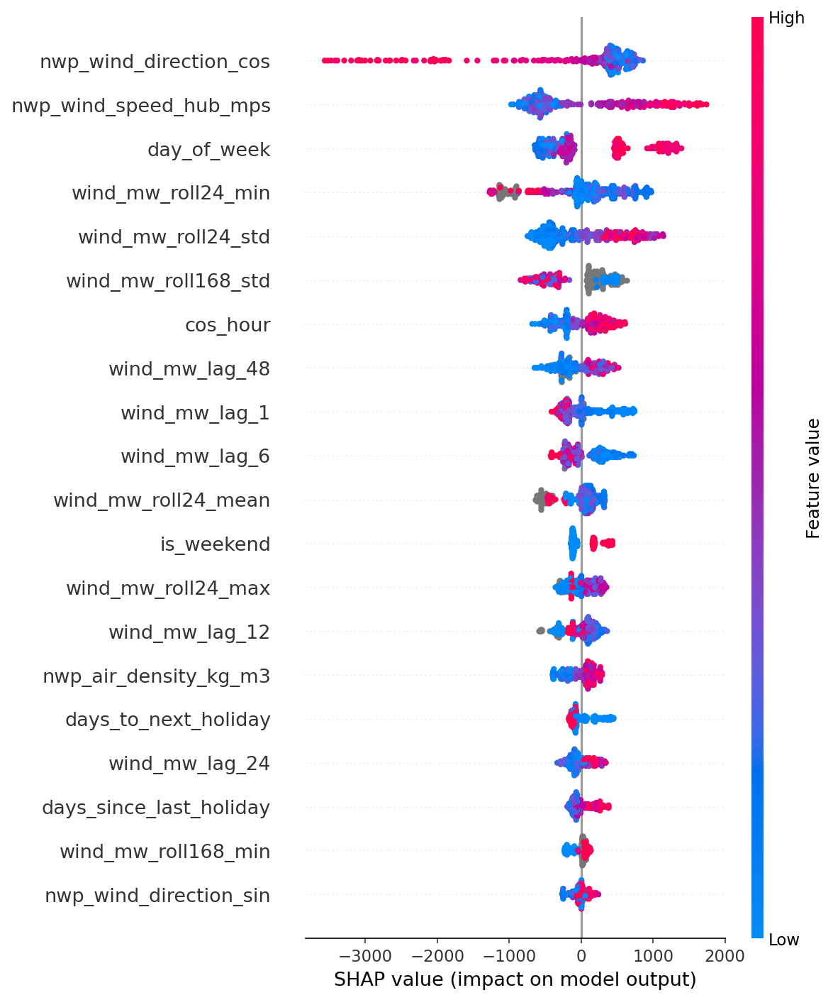
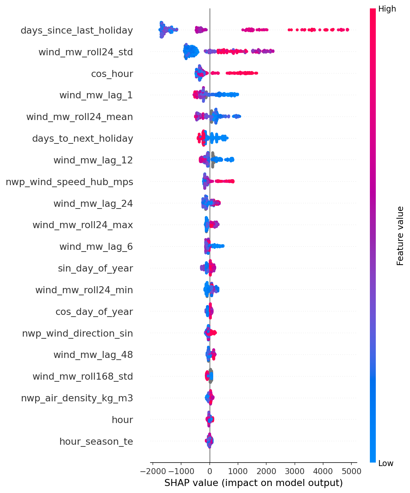
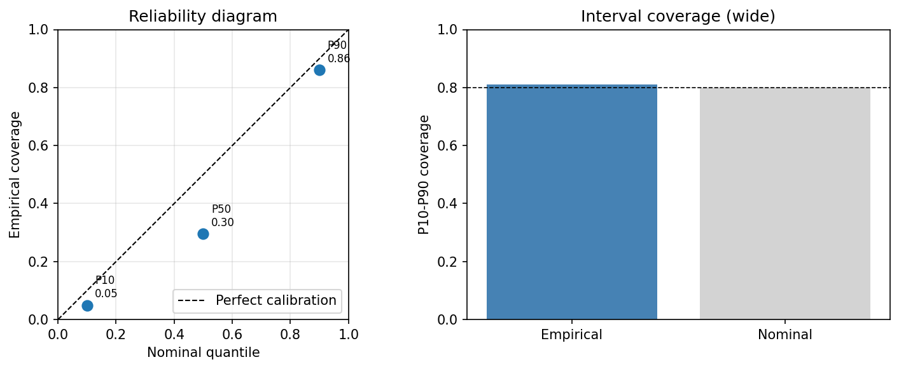
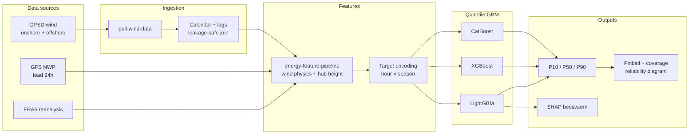

# Day-ahead probabilistic wind forecast

German national wind power, **24 hours ahead**, as an **uncertainty envelope** — not a single megawatt number.

Traders submit day-ahead schedules near **P50** (median). Dispatchers and TSOs size **regulating reserve** from the **P10–P90 band**: wide intervals flag hours where imbalance risk is high even when the median looks fine. This repo trains **quantile gradient boosting** models (LightGBM, XGBoost, CatBoost) with pinball loss, evaluates calibration with reliability diagrams, and explains drivers with SHAP.

**Study window:** June 2019, DE aggregate onshore + offshore wind (~358 day-ahead hours). Numbers are illustrative on a short sample; the pipeline is built for multi-year reruns.

| Quantile | Label | Operational meaning |
|----------|-------|---------------------|
| 0.10 | **P10** | ~10% chance actual generation falls below this level |
| 0.50 | **P50** | Median — primary schedule / bid anchor |
| 0.90 | **P90** | ~90% chance actual generation falls below this level |

---

## Why quantile GBMs beat a point forecast alone

A single MAE-optimal forecast tells you **expected** output. It does not tell you **how wrong** you could be hour by hour.

| Question | Point GBM / MAE model | Quantile GBM (this repo) |
|----------|----------------------|---------------------------|
| Day-ahead bid volume | One number per hour | **P50** per hour |
| Reserve / flex sizing | Heuristic buffers on MAE | **P90 − P10** width + calibrated coverage |
| Tail / ramp risk | Hidden in aggregate error | **P90** SHAP shows upside drivers |
| Settlement exposure | Under-procure if errors are skewed | Explicit **P10/P90** labels for risk teams |

Gradient boosting with pinball loss is the workhorse in utility production forecasting: fast on tabular weather features, native quantile objectives, and interpretable with SHAP. Deep models help at scale; for national day-ahead wind with ERA5/NWP covariates, **quantile GBMs remain the baseline to beat**.

**Dispatch intuition:** if P90 − P10 is 4 GW for an hour, a conservative desk might hold ~2 GW of upward/downward flex around P50 (rules vary by TSO). **Under-calibrated** bands shrink that buffer on paper while real weather error stays the same — a direct path to balancing activation and imbalance charges.

---

## What SHAP revealed

SHAP on the tuned LightGBM (exploratory in-sample encoding; see caveats below):



**P50 (median schedule):** NWP **hub wind speed** and **wind direction** (cos component) set most of the level. **Recent generation** (`wind_mw_lag_1`, `roll24_min`) acts as a residual corrector — high recent output often pulls the median down once weather is fixed. **Diurnal** encodings (`cos_hour`) add a modest time-of-day nudge.



**P90 (upside tail):** same NWP-first structure, plus **tail-specific** drivers — **`wind_mw_roll24_std`** (high recent volatility widens the upper band) and **`wind_mw_lag_48`** (two-day persistence supports upside). Holiday proximity features rank higher at P90 than P50; treat as weak calendar proxies on this short sample.

Full feature-by-feature notes: [reports/SHAP_INTERPRETATION.md](reports/SHAP_INTERPRETATION.md).

---

## Calibration

After Optuna tuning on rolling-origin CV pinball loss, out-of-fold **P10–P90 coverage** is **81%** (nominal 80%) on the June 2019 holdout folds — slightly **too wide** vs default hyperparameters (~59% coverage, intervals too narrow).



Points **below** the diagonal mean under-coverage at that quantile; the interval panel compares empirical vs 80% nominal PI coverage. Regenerate: `py scripts/run_finalize.py -v` (or `--skip-tune` with locked params).

---

## Results

### Backend comparison (default hyperparameters, fold-wise target encoding)

Rolling-origin CV, 5 folds, `hour_season` target-encoded per fold. Only folds 4–5 have test rows on this short window.

| backend | encoding | pinball_q10 | pinball_q50 | pinball_q90 | pi_coverage | mae (P50) | rmse | mape | train_time_sec |
| --- | --- | --- | --- | --- | --- | --- | --- | --- | --- |
| **lightgbm** | target | 647.8 | 1620.5 | 1466.2 | **0.586** | 3241.1 | 4213.6 | 43.7 | 2.5 |
| xgboost | target | 973.3 | 2044.8 | 1342.6 | 0.502 | 4089.7 | 5269.6 | 61.4 | 1.8 |
| catboost | target | 991.5 | 1567.0 | 1421.0 | 0.399 | 3134.1 | 4063.2 | 44.6 | 4.1 |
| catboost | native | 949.3 | 1682.4 | 1519.2 | 0.375 | 3364.7 | 4298.0 | 46.2 | 10.9 |

**LightGBM + target encoding** wins on pinball_q50 and pi_coverage among defaults. Regenerate: `py scripts/run_comparison.py -v` → `results/backend_comparison.csv`.

### Tuned LightGBM (Optuna, locked in `results/final_model_params.json`)

| metric | value |
|--------|-------|
| mean pinball (q10+q50+q90) | **986.0** MW |
| pinball_q50 | 1607.9 |
| pi_coverage (P10–P90) | **0.814** |
| MAE on P50 | 3215.8 MW |
| RMSE on P50 | 3998.3 MW |

---

## Architecture



**Leakage control:** autoregressive lags are joined at `init_time` (NWP issue time), not `valid_time`. ERA5 hindcast columns are excluded from the day-ahead feature matrix.

---

## Reproduce end-to-end

```powershell
git clone https://github.com/mehmetertac/wind-quantile-forecast.git
cd wind-quantile-forecast

py -m venv .venv
.venv\Scripts\Activate.ps1

pip install -r requirements-dev.txt
pip install -r requirements-weather.txt   # editable ../energy-feature-pipeline
pip install -e .
pre-commit install

# 1. Build day-ahead table (OPSD + ERA5/NWP features, lead=24h)
pull-wind-data --start 2019-06-01 --end 2019-06-15
# Optional: pull-wind-data --download-era5  (needs ~/.cdsapirc)

# 2. Compare GBM backends (default hyperparameters)
py scripts/run_comparison.py -v

# 3. Tune LightGBM, final CV, calibration plot, locked params
py scripts/run_finalize.py -v --n-trials 40

# 4. SHAP summary plots (or: py scripts/run_finalize.py -v --skip-tune --shap)
py scripts/run_shap.py -v

# 5. Tests
pytest -q
ruff check src tests
```

**Generated artifacts** (gitignored locally; figures above are copied to `docs/images/` for the README):

| Path | Contents |
|------|----------|
| `results/metrics.csv` | Per-fold CV metrics |
| `results/backend_comparison.csv` | Backend sweep |
| `results/final_model_params.json` | Tuned hyperparameters + CV summary |
| `results/figures/reliability_diagram.png` | Calibration / reliability |
| `results/figures/shap_summary_p*.png` | SHAP beeswarms |
| `reports/figures/` | Alternate SHAP output from `run_shap.py` |

Extend the window (`pull-wind-data --start 2018-01-01 --end 2020-12-31`) before trusting calibration or SHAP calendar effects.

---

## Repository layout

```
wind-quantile-forecast/
├── src/wind_quantile_forecast/
│   ├── data/           # OPSD + day-ahead dataset build
│   ├── features/       # calendar, lags, target encoding
│   ├── models/         # pinball loss, QuantileGBM
│   ├── evaluation/     # CV, metrics, reliability, tuning
│   └── interpret/      # SHAP
├── scripts/            # run_cv, run_comparison, run_finalize, run_shap, run_tune
├── tests/unit/
├── docs/images/        # README figures (committed)
├── reports/            # SHAP_INTERPRETATION.md
├── data/{raw,processed}/  # gitignored contents
└── results/            # metrics + figures (gitignored)
```

---

## Data

| Layer | Source | Role |
|-------|--------|------|
| Generation | [OPSD](https://open-power-system-data.org/) | `wind_mw` target (DE onshore + offshore) |
| Reanalysis | Copernicus ERA5 | Hindcast weather + physics features |
| NWP | GFS via Herbie | Day-ahead covariates at 24 h lead |

Features are built through the sibling [energy-feature-pipeline](https://github.com/mehmetertac/energy-feature-pipeline) (calendar, wind physics, hub-height extrapolation).

---

## Caveats

- **Sample:** two weeks of June 2019 — calm spells inflate MAPE; frontal ramps underrepresented.
- **SHAP encoding:** `run_shap.py` uses in-sample LOO target encoding for driver analysis, not fold-safe production encoding.
- **Quantile crossing:** independent pinball fits per quantile; `enforce_monotonic` sorts P10 ≤ P50 ≤ P90 at predict time (default in finalize/CV).
- **CLI:** `wind-forecast` entry point is not yet wired end-to-end.

Further narrative: [WEEK_03_REFLECTION.md](WEEK_03_REFLECTION.md).

---

## License

Apache-2.0 — see [LICENSE](LICENSE).

**Release:** v0.1.0 — initial public quantile GBM stack, calibration plots, and SHAP interpretability.
