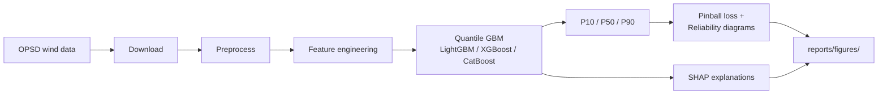

# wind-quantile-forecast

Day-ahead probabilistic wind power forecast producing **P10 / P50 / P90** quantiles, evaluated with pinball loss and reliability diagrams.

## Why it matters

Most utility production forecasting still runs on quantile gradient boosting models, not deep learning. This project covers the full production stack: LightGBM, XGBoost, CatBoost, pinball loss, SHAP interpretability, and target encoding for high-cardinality features.

## Problem

Given historical wind generation and weather features, predict the next-day hourly wind power distribution as three quantiles:

| Quantile | Label | Meaning |
|----------|-------|---------|
| 0.10 | P10 | 10 % chance actual generation falls below this value |
| 0.50 | P50 | Median (point) forecast |
| 0.90 | P90 | 90 % chance actual generation falls below this value |

## Data source

[Open Power System Data (OPSD)](https://open-power-system-data.org/) — real EU wind generation time series, freely downloadable as CSV.

## Tech stack

- **Models:** LightGBM, XGBoost, CatBoost (quantile regression via pinball loss)
- **Interpretability:** SHAP
- **Encoding:** Target encoding for high-cardinality categorical features
- **Evaluation:** Pinball loss, coverage metrics, reliability (calibration) diagrams

## Repository layout

```
wind-quantile-forecast/
├── src/wind_quantile_forecast/
│   ├── config.py              # paths, quantiles, seeds
│   ├── data/                  # OPSD download + preprocessing
│   ├── features/              # calendar, lags, target encoding
│   ├── models/                # pinball loss + QuantileGBM wrapper
│   ├── evaluation/            # metrics, reliability, plots
│   ├── interpret/             # SHAP explanations
│   └── cli.py                 # pipeline entry point
├── tests/
│   ├── unit/                  # unit tests (pinball loss, etc.)
│   └── integration/           # end-to-end pipeline tests
├── data/{raw,processed}/      # data directories (contents gitignored)
├── reports/figures/           # calibration plots + SHAP output
├── notebooks/                 # exploratory analysis
├── scripts/                   # pre-commit helpers
├── AGENTS.md                  # contributor / agent governance rules
└── requirements.txt
```

## Pipeline



## Setup

```powershell
# Clone and enter the repo
git clone https://github.com/mehmetertac/wind-quantile-forecast-.git
cd wind-quantile-forecast-

# Create virtual environment
py -m venv .venv
.venv\Scripts\Activate.ps1

# Install dependencies
pip install -r requirements-dev.txt
pip install -e .

# Install pre-commit hooks (runs tests + file-size check before commit)
pre-commit install
```

## Usage

```powershell
# Run the full pipeline (not yet implemented)
wind-forecast --country DE --backend lightgbm

# Run tests
pytest

# Run linting
ruff check src tests
```

## Deliverables

- [ ] OPSD data ingestion and preprocessing
- [ ] Feature engineering (calendar, lags, target encoding)
- [ ] Quantile GBM models (LightGBM, XGBoost, CatBoost)
- [ ] Pinball loss evaluation
- [ ] Reliability / calibration diagrams
- [ ] SHAP feature importance plots

## License

Apache-2.0 — see [LICENSE](LICENSE).
